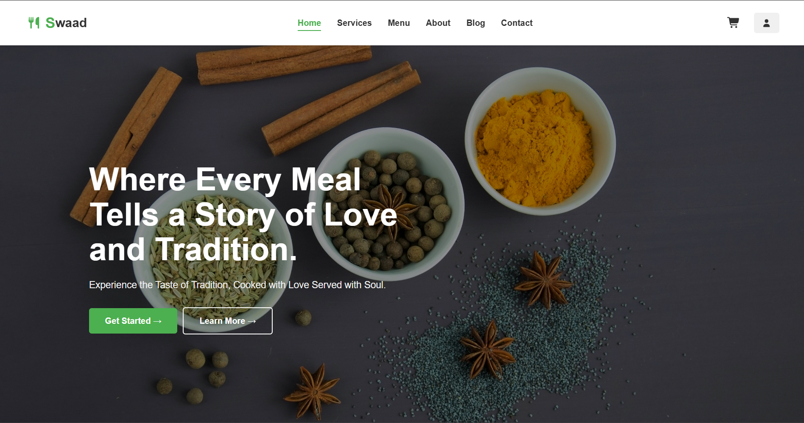

#  Swaad - A Modern Catering Service Website



Swaad is a modern, full-featured web application for a catering service, built with the MERN stack (MongoDB, Express, React, Node.js). It provides a seamless and intuitive user experience, allowing customers to browse menus, customize orders, and book catering services for their events.

---

##   Features

This application is packed with features designed to provide a complete and professional user journey.

### **Frontend (React)**
* **Fully Responsive Design:** A beautiful and consistent UI across all devices.
* **Multi-Page Navigation:** Built with React Router, including pages for Home, About, Services, Menu, Blog, and Contact.
* **Interactive Menu:** A dynamic menu with nested accordions for different cuisines and categories.
* **Real-time Cart Management:** Users can add items, and an interactive quantity controller `(- 1 +)` allows for easy modification of the cart.
* **Global State Management:** Utilizes React's Context API to manage user authentication and cart state across the entire application.
* **Protected Checkout Flow:** Users can browse freely, but are prompted to log in or sign up via a popup modal when they proceed to book an order.
* **Animated UI Components:** Smooth CSS animations for the login modal, success popups, and order confirmation screen to enhance user experience.
* **User Profile Dashboard:** A dropdown dashboard for logged-in users to view their profile and access their order history.

### **Backend (Node.js & Express)**
* **User Authentication:** Secure user registration and login with JWT (JSON Web Tokens).
* **Database Integration:** MongoDB with Mongoose for storing user data, menu items, and orders.
* **RESTful API:** A well-structured API for the frontend to communicate with the database.
* **Order Management:** An endpoint to receive and store detailed order information.

---

##   Tech Stack

* **Frontend:** React, React Router, React Context API, Font Awesome
* **Backend:** Node.js, Express.js
* **Database:** MongoDB (with Mongoose)

---

##   Getting Started

To get a local copy up and running, follow these simple steps.

### **Prerequisites**
* Node.js and npm installed on your machine.
* MongoDB installed and running locally, or a connection string from MongoDB Atlas.

### **Installation**

1.  **Backend Setup**
    * Clone your backend repository:
        ```sh
        git clone [link-to-your-backend-repo]
        ```
    * Navigate to the backend folder and install dependencies:
        ```sh
        cd your-backend-folder
        npm install
        ```
    * Create a `.env` file and add your configuration (e.g., `MONGO_URI`, `JWT_SECRET`).
    * Start the backend server:
        ```sh
        npm start
        ```

2.  **Frontend Setup**
    * Clone this frontend repository:
        ```sh
        git clone [link-to-this-frontend-repo]
        ```
    * Navigate to the frontend folder and install dependencies:
        ```sh
        cd swaad
        npm install
        ```
    * Start the React development server:
        ```sh
        npm start
        ```
    The application will be available at `http://localhost:3000`.

---

##  How It Works (User Flow)

1.  **Browse:** A user lands on the homepage and can explore the various pages like Services and About.
2.  **Select Menu:** The user navigates to the Menu page, chooses a cuisine (e.g., Gujarati), and browses the items.
3.  **Add to Cart:** The user adds items to their cart. The "Add" button transforms into a quantity controller, and the cart icon in the header updates with a counter.
4.  **Review Order:** The user goes to the Cart page to review their items and the total bill, including taxes.
5.  **Login/Signup:** Upon clicking "Confirm Order," a login/signup modal pops up (if the user is not logged in). The user can log in or create an account. The items in their cart remain safe.
6.  **Book Event:** Once logged in, the user is redirected to the Booking page to fill in event details (venue, date, time, etc.).
7.  **Payment:** The user proceeds to the Payment page, which displays a final summary and a mock credit card form.
8.  **Confirmation:** After "paying," a full-screen animated popup confirms that the order was successful.
9.  **View History:** The user can now click on their profile icon in the header to see a dropdown with their details and a link to their "Order History," where the new order is now visible.

---

##   Contributing

Contributions, issues, and feature requests are welcome. Feel free to check the issues page if you want to contribute.

---

##   License

Distributed under the MIT License. See `LICENSE` for more information.

---

##   Contact

Rishi Gehani - rishigehani18@gmail.com
Sohan Thakur - sohant444@gmail.com

Project Link: [https://github.com/Rishi-Gehani/Swaad]